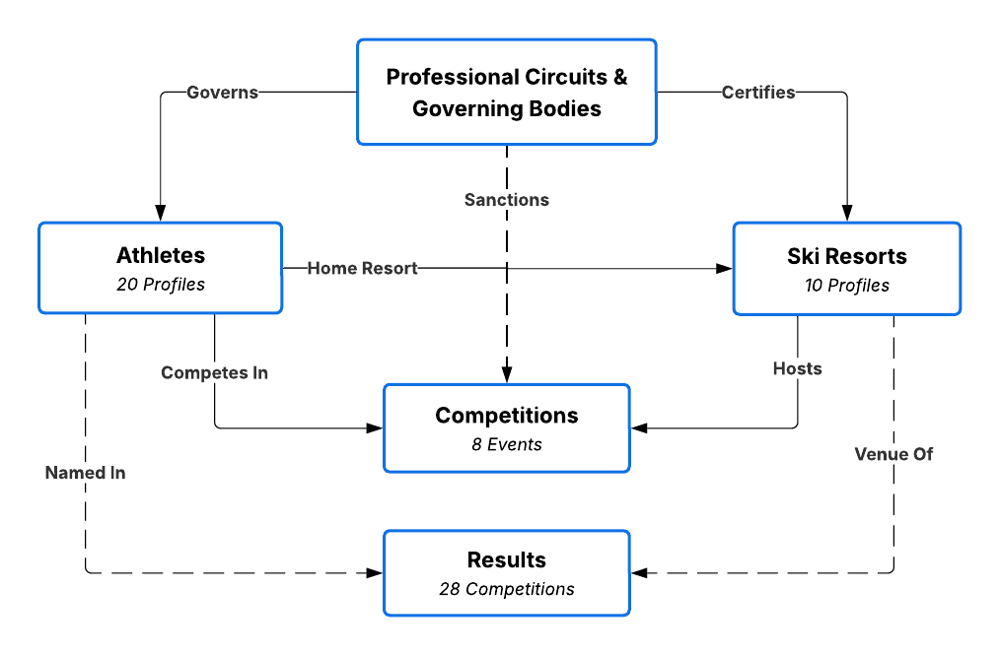

# Trailhead
Trailhead is a snow-sports RAG app that answers questions over a richly linked world of athletes, resorts, competitions, and results. It pairs grounded retrieval, cited answers, evaluation tooling, and a clean UI, with just enough mountain energy to make the whole thing more fun than your average AI demo.

`Hierarchical retrieval` `Cited answers` `RAG sweeps` `Trace analysis` `Dockerized UI`

<!-- Best screenshot placement: insert a Trailhead UI screenshot here, directly under the intro and before the feature sections.
Example:

-->

## What Trailhead Can Do

- Answer questions over a cross-linked snow-sports knowledge base instead of a pile of unrelated documents.
- Surface relevant passages and generate grounded responses with citations.
- Experiment with chunking, embeddings, retrieval settings, and evaluation sweeps.
- Analyze production-style traces and compare retrieval quality across configurations.
- Run locally with `uv` or launch the app in Docker.

## Quickstart

### Local

```bash
uv sync --group dev
uv run snow-sports-rag-ui --auto-index
```

### Docker

```bash
docker compose up --build
```

Open `http://localhost:7860`.

## Technical Highlights

- **Hierarchical RAG pipeline** with retrieval presets, per-stage latency capture, and source cards.
- **Config-driven experimentation** for chunking, embeddings, reranking, query expansion, and generation.
- **Evaluation tooling** including a gold set, sweep runner, and trace analysis CLI.
- **Production-minded setup** with Docker, Compose, CI, and isolated `uv` workflows.

## Try These Questions

- `Which resort is most associated with Mikaela Shiffrin?`
- `Who won the 2018 Pyeongchang snowboard slopestyle event?`
- `How does Dew Tour relate to Olympic qualification?`
- `Which athletes in the knowledge base are tied to Park City?`
- `What does the knowledge base say about Shaun White's Olympic history?`

## Knowledge Base

The corpus in `knowledge-base/` is synthetic, but it is designed to behave like a real snow-sports information system. Files cross-reference each other across athletes, resorts, competitions, circuits, and results, which makes the project a good fit for retrieval-augmented generation.



| Area | `knowledge-base/` path | What you’ll find |
| --- | --- | --- |
| Circuits & orgs | `circuits/` | NGBs, series, pathways (e.g. Olympic, FIS, US governing structure). |
| Athletes | `athletes/` | Per-athlete profile: summary (discipline, home resort, bio), career highlights, progression, circuits entered, sponsors, performance notes. |
| Resorts | `resorts/` | Location and stats, competition infrastructure, notable athletes, parks/pipe, hosting history. |
| Competitions | `competitions/` | Sanctioning, disciplines, cadence, venues, format/judging, US champions, Olympic or qualifier context. |
| Event results | `results/` | Dated event pages: event metadata, podium, US narratives, season impact, notable moments. |

All profiles follow a consistent Markdown structure with `#` titles, `##` sections, and repeatable fields. Cross-references point at related `doc_id`s in the same tree, so retrieval has real relationships to exploit without needing a separate knowledge graph.

## Evaluation

- **Sweep runner:** `uv run snow-sports-rag-sweep`
- **Trace analysis:** `uv run snow-sports-rag-trace-analyze --help`
- **Tests:** `uv run pytest`

## Development

- Install: [uv](https://docs.astral.sh/uv/) — `uv sync --group dev` from the repo root (includes pytest and ruff; matches CI); run tools with `uv run …`.
- **Tests:** `uv run pytest` (default: excludes tests marked `integration` — no heavy models or network).
- **Integration tests:** `uv run pytest -m integration` (Chroma on disk, sentence-transformers, etc.).
- **Eval CLIs:** `uv run snow-sports-rag-sweep`, `uv run snow-sports-rag-trace-analyze --help` (see [docker/README.md](docker/README.md) for container use).

## Tech Stack

- **Language:** Python 3.11+
- **Package / env management:** `uv`
- **UI:** Gradio
- **Embeddings:** Sentence Transformers
- **Vector store:** ChromaDB
- **RAG orchestration:** custom pipeline with hierarchical retrieval, reranking, and grounded generation
- **Evaluation:** gold-set sweeps, trace analysis, pytest
- **CI:** GitHub Actions
- **Containerization:** Docker + Docker Compose
