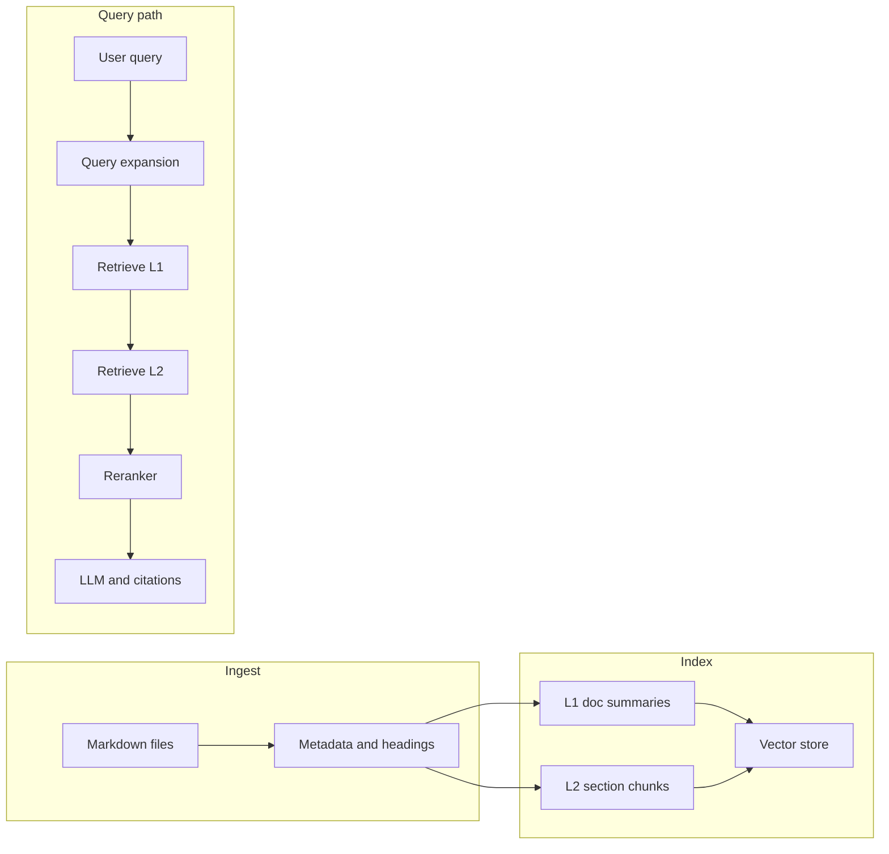
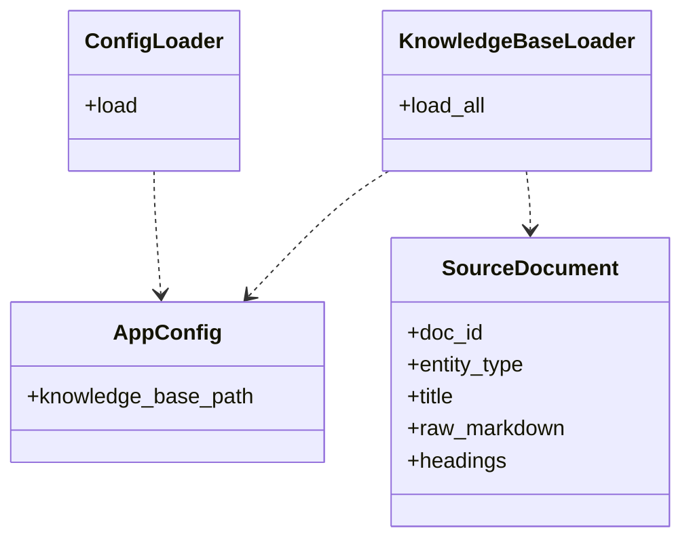
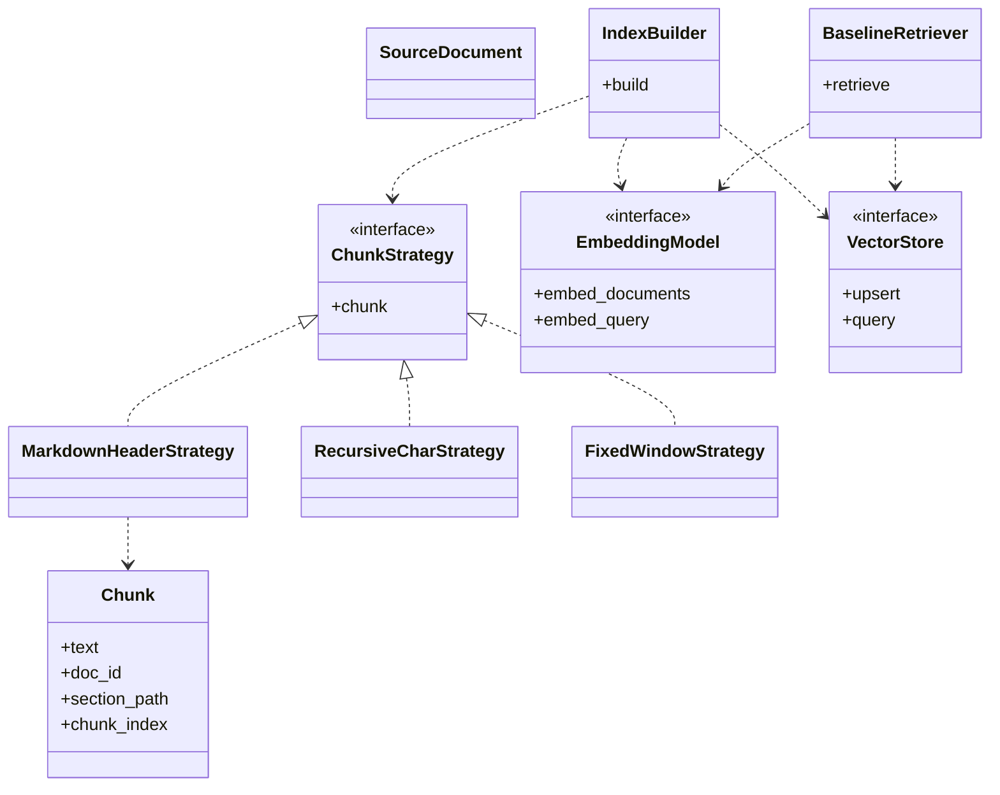
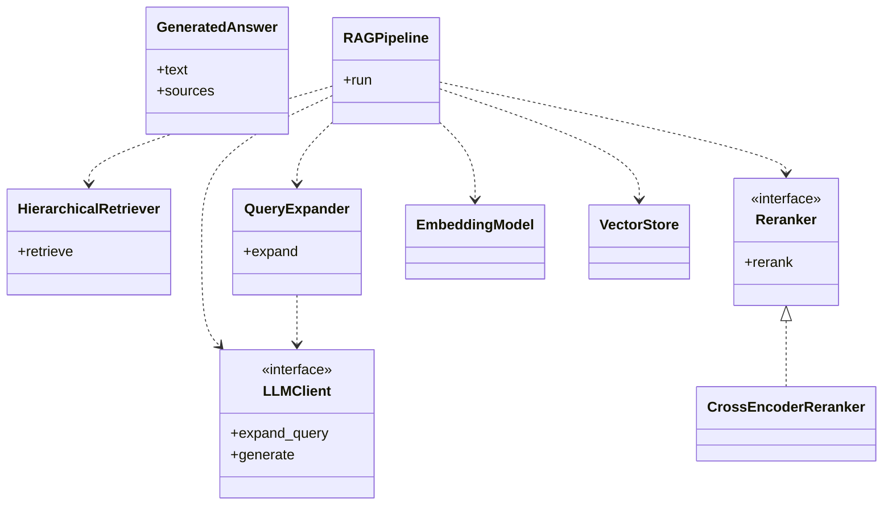
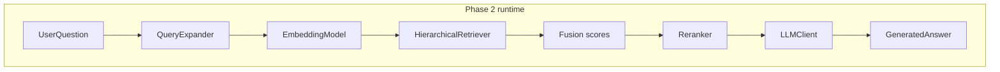
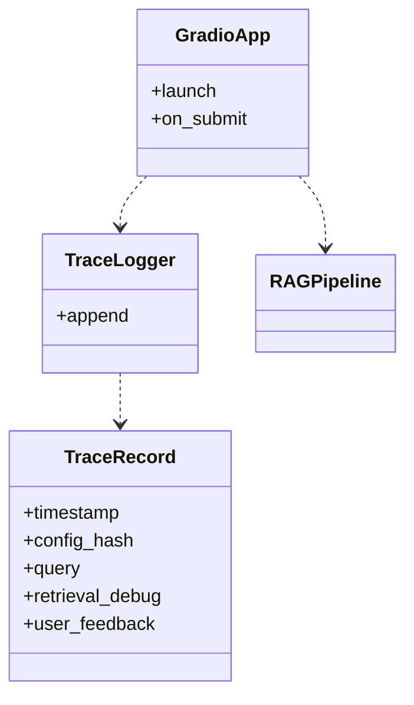
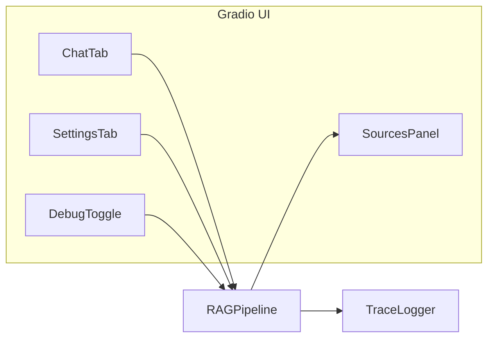
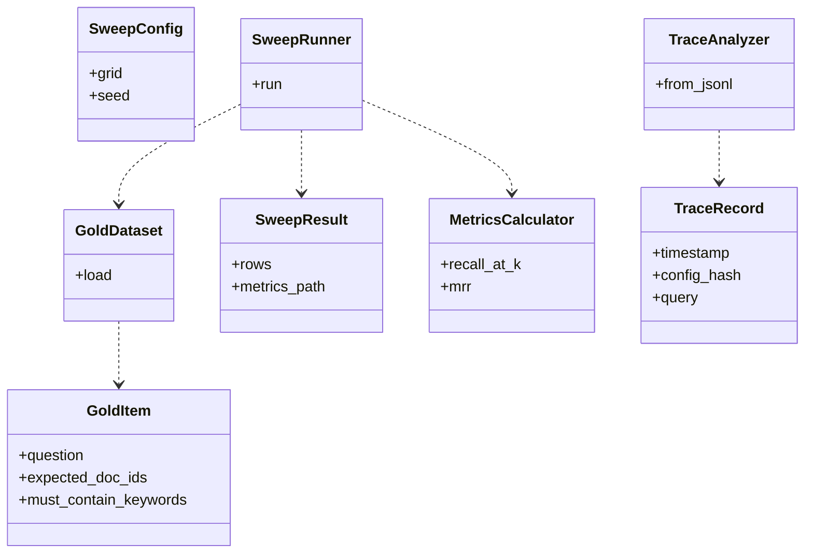

# Snow Sports RAG — phased implementation plan

This document is the canonical build plan for an elegant, **lightweight** RAG application over the Markdown corpus in [`knowledge-base/`](../knowledge-base/). It is organized into **phases** with goals, deliverables, technical detail, **simple UML sketches** (Mermaid) of the target code shape, and exit criteria.

**Viewing diagrams.** On GitHub, open this file in the browser: fenced blocks with language tag `mermaid` render as diagrams. In Cursor/VS Code, the built-in Markdown preview often does **not** draw Mermaid unless you add a preview extension (for example [Markdown Preview Mermaid Support](https://marketplace.visualstudio.com/items?itemName=bierner.markdown-mermaid)). You can also paste a diagram into [mermaid.live](https://mermaid.live) to validate syntax.

---

## Baseline context

**Corpus.** Roughly 70 Markdown files under `knowledge-base/` in five subtrees: `athletes/`, `resorts/`, `competitions/`, `circuits/`, `results/`. Documents share a predictable structure (top-level `#` title, `##` sections, bullet lists, cross-references). That supports **header-aware chunking** and **hierarchical** (document → section) retrieval without a full knowledge graph.

**Starting point.** Application code is **greenfield**: add `pyproject.toml`, a committed **`uv.lock`**, library modules under **`src/`** (import name `snow_sports_rag` via setuptools `package-dir`), deployment-oriented scripts under **`app/`** (process entrypoints, future Gradio/Docker hooks), plus `tests/`, `configs/`, and `evaluation/` assets as you implement.

**Package manager.** Use **[uv](https://docs.astral.sh/uv/)** for everything: create the project, pin Python, resolve dependencies, and run commands in an isolated environment (`uv sync`, `uv run …`). Do not maintain a separate `requirements.txt` unless an external constraint forces it.

**Design principles.**

- **Thin orchestration:** small modules; one `RAGPipeline` (or equivalent) composes steps.
- **Config-driven R&D:** chunk sizes, strategy names, embedding model ids, `k`, feature flags live in versioned configs.
- **Stable interfaces:** `ChunkStrategy`, `EmbeddingModel`, `VectorStore`, `Reranker`, `LLMClient` as protocols or ABCs for swaps and fakes in tests.

**Docstrings (NumPy style).** Public modules, classes, and functions use **[NumPy-style docstrings](https://numpydoc.readthedocs.io/en/latest/format.html)** so APIs stay consistent and tooling (Sphinx, numpydoc, IDE hints) can render them: a one-line summary, optional extended description, then sections such as **Parameters**, **Returns**, **Raises**, **Attributes** (for class fields and notable instance state), **Notes**, and **Examples** where they add clarity. Keep tests readable; full NumPy sections are optional in test files unless a helper is reused widely.

---

## Architecture overview

End-to-end data flow:

---

## Phase 0 — Foundation, tooling, and ingestion

**Goal.** A runnable Python package that loads the knowledge base, normalizes **metadata**, and exposes an entrypoint to list or load documents — no LLM yet.

**Deliverables.**

- **Project scaffold:** `pyproject.toml` with `requires-python >= 3.11`, dependencies and **dev** deps (e.g. `pytest`, `ruff`) via uv **dependency groups** or optional dev extras; **`uv.lock`** checked in; optional `[tool.uv]` / `[tool.ruff]` / `[tool.pytest.ini_options]`. Onboarding: `uv sync` then `uv run pytest`.
- **Package layout:** `src/` contains `ingest/`, `config/`, package `__init__.py`, and CLI modules (other subpackages added in later phases). **`app/`** holds deployment entrypoints (e.g. `app/main.py` wrapping the CLI today; Gradio or ASGI later). The import path remains `snow_sports_rag` (underscores); the git repo folder is `snow-sports-rag` (hyphens).
- **Configuration:** `configs/default.yaml` merged with env/CLI overrides; keys stubbed for later phases (`chunking`, `embedding`, `retrieval`, `rerank`, `llm`, `logging`).
- **Ingestion:** Walk `knowledge-base/**/*.md`. Emit `SourceDocument` with `doc_id`, `entity_type`, `title`, `raw_markdown`, `headings`.
- **Tests:** Unit tests for path normalization, title extraction, heading parsing (1–2 string fixtures, no network).

**Exit criteria.** `uv run pytest` passes; iterate all KB files with correct `doc_id` and `entity_type`.

### Phase 0 — UML (conceptual)

---

## Phase 1 — Chunking R&D, encoders, vector index, baseline retrieval

**Goal.** Chunks → **swappable bi-encoder** → **vector index** → **single-stage dense retrieval** (no hierarchical gating, rerank, or expansion yet).

### 1.1 Chunking R&D

**Interface.** `ChunkStrategy.chunk(document) -> list[Chunk]` with `text`, `doc_id`, `entity_type`, `section_path`, `chunk_index`.

**Strategies (minimum three).**

- **Markdown-header:** Split on `##`; sub-split oversized sections with overlap.
- **Recursive-character:** Baseline splitter over text.
- **Fixed-size:** Sliding window over full document.

Parameters in config for Phase 4 sweeps.

### 1.2 Encoder R&D

**Interface.** `EmbeddingModel.embed_documents`, `embed_query`; normalize for cosine in one place. At least two concrete models (e.g. MiniLM vs MPNet). Persist `model_name` and `dimension` in index metadata.

### 1.3 Vector store

Wrap Chroma, LanceDB, or FAISS+metadata behind `VectorStore`. Persist under `./data/` or `./.rag_index/` (gitignored).

### 1.4 Baseline retrieval

Embed query → top-`k` by similarity → ranked `RetrievalHit` list.

**Tests.** Unit: chunking fixtures. Integration: `tmp_path` + **fake embedder** (deterministic vectors).

**Exit criteria.** Script: ingest → chunk → embed → index → query → top-5 with `doc_id` and `section_path`.

### Phase 1 — UML (conceptual)

---

## Phase 2 — Advanced RAG: hierarchical retrieval, query expansion, re-ranking, generation

**Goal.** **Hierarchical** L1/L2 retrieval, **query expansion**, **cross-encoder rerank**, **LLM** answers with citations.

### 2.1 Hierarchical retrieval

- **L1:** One summary embedding per doc (title + key overview section by heuristic).
- **L2:** Section chunks from Phase 1.
- **Flow:** L1 top-`M` `doc_id`s → filtered L2 search → optional global L2 fallback → deduped context for rerank/generation.

### 2.2 Query expansion

`LLMClient.expand_query` → paraphrases; multi-query embed; merge by max score or RRF; cap `top_n_pre_rerank`.

### 2.3 Re-ranking

`Reranker.rerank(query, passages, top_k)` with cross-encoder; optional via config.

### 2.4 Generation

`LLMClient.generate` with context blocks labeled by `doc_id` / `section_path`; structured sources for UI.

**Exit criteria.** Full pipeline driven by config: question → (expansion) → hierarchical retrieve → fuse → rerank → cited answer.

### Phase 2 — UML (conceptual)

**Component view (pipeline steps):**

---

## Phase 3 — Gradio frontend, operations, and trace logging

**Goal.** Clean **Gradio** UI and **trace** logging for production-style evaluation later.

**UI.** Chat + Sources panel; Settings (preset/config display); **Debug** toggle (expansions, L1 shortlist, pre/post rerank lists).

**Run command.** Document launching the UI with **`uv run`** (for example `uv run python -m snow_sports_rag.gradio_app` or a script entry in `pyproject.toml`) so the Gradio process uses the locked env from `uv.lock`.

**Traces.** Append JSON lines: timestamp, `config_hash`, query, expansions, L1/L2 ids, scores, optional thumbs up/down.

**Exit criteria.** Demo-ready UI; trace file is valid JSONL per line.

### Phase 3 — UML (conceptual)

---

## Phase 4 — Evaluation module, R&D sweeps, test completion

**Goal.** **Gold** Q&A set, **sweep** runner over chunk/encoder/config grids, **metrics**, **trace** aggregation, pytest completion.

### 4.1 Gold set

`evaluation/gold_qa.jsonl`: `question`, `expected_doc_ids` and/or `must_contain_keywords`, optional `gold_answer`.

### 4.2 Sweep runner

CLI (invoked via `uv run python -m …` or a `[project.scripts]` entry) loads grid (chunk strategy, sizes, embed model, flags); writes `evaluation/runs/<timestamp>/` with `metrics.json` (+ optional CSV).

**Metrics.** Recall@k, MRR, latency p50/p95; optional nDCG.

### 4.3 Production-style eval

Script reads `traces.jsonl`; aggregates feedback by `config_hash`; optional regression vs gold baseline.

### 4.4 Pytest

Unit: chunking, fusion, hierarchical filter, config merge. Integration: full pipeline with fakes in `tmp_path`.

**Exit criteria.** Minimal sweep (e.g. 2×2 grid) runs; `uv run pytest` green (or equivalent CI using `uv sync` + `uv run pytest`).

### Phase 4 — UML (conceptual)

---

## Cross-phase checklist

- **Chunking R&D:** Three strategies, config-tunable, swept in Phase 4.
- **Encoder R&D:** Two+ bi-encoders, same gold protocol.
- **Query expansion:** LLM paraphrases + fusion + caps.
- **Re-ranking:** Cross-encoder, ablatable.
- **Hierarchical:** L1 summaries + gated L2 + fallback.

---

## Suggested timeline (self-paced)

- **Week 1:** Phases 0–1.
- **Week 2:** Phase 2.
- **Week 3:** Phases 3–4.

---

## Risks and mitigations

- **LLM cost/latency:** Optional expansion/generation; cache expansions; small model for expansion only.
- **Chunking bias:** Validate on `results/` and long `circuits/` files.
- **Index portability:** Pin deps; store `model_name` with index.

---

## Documentation

After implementation, update [`README.md`](../README.md) with: **installing uv**, `uv sync`, env vars, and example commands using **`uv run`** (Gradio app, index rebuild, evaluation sweeps, `uv run pytest`). Mention that `uv.lock` is the source of truth for reproducible installs.
